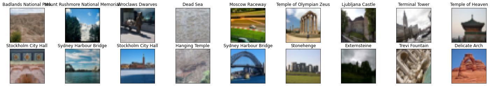
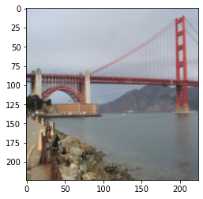
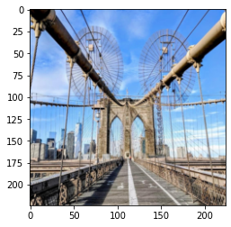
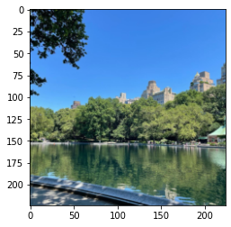
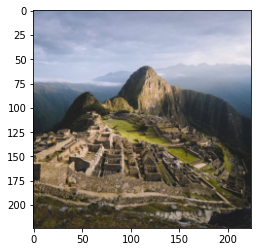
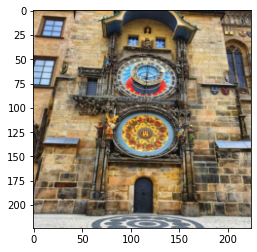

# Convolutional Neural Networks

## Project: Write an Algorithm for Landmark Classification

---

In this notebook, some template code has already been provided for you, and you will need to implement additional functionality to successfully complete this project. You will not need to modify the included code beyond what is requested. Sections that begin with **'(IMPLEMENTATION)'** in the header indicate that the following block of code will require additional functionality which you must provide. Instructions will be provided for each section, and the specifics of the implementation are marked in the code block with a 'TODO' statement. Please be sure to read the instructions carefully! 

> **Note**: Once you have completed all the code implementations, you need to finalize your work by exporting the Jupyter Notebook as an HTML document. Before exporting the notebook to HTML, all the code cells need to have been run so that reviewers can see the final implementation and output. You can then export the notebook by using the menu above and navigating to **File -> Download as -> HTML (.html)**. Include the finished document along with this notebook as your submission.

In addition to implementing code, there will be questions that you must answer which relate to the project and your implementation. Each section where you will answer a question is preceded by a **'Question X'** header. Carefully read each question and provide thorough answers in the following text boxes that begin with **'Answer:'**. Your project submission will be evaluated based on your answers to each of the questions and the implementation you provide.

>**Note:** Code and Markdown cells can be executed using the **Shift + Enter** keyboard shortcut.  Markdown cells can be edited by double-clicking the cell to enter edit mode.

The rubric contains _optional_ "Stand Out Suggestions" for enhancing the project beyond the minimum requirements. If you decide to pursue the "Stand Out Suggestions", you should include the code in this Jupyter notebook.

---
### Why We're Here

Photo sharing and photo storage services like to have location data for each photo that is uploaded. With the location data, these services can build advanced features, such as automatic suggestion of relevant tags or automatic photo organization, which help provide a compelling user experience. Although a photo's location can often be obtained by looking at the photo's metadata, many photos uploaded to these services will not have location metadata available. This can happen when, for example, the camera capturing the picture does not have GPS or if a photo's metadata is scrubbed due to privacy concerns.

If no location metadata for an image is available, one way to infer the location is to detect and classify a discernible landmark in the image. Given the large number of landmarks across the world and the immense volume of images that are uploaded to photo sharing services, using human judgement to classify these landmarks would not be feasible.

In this notebook, you will take the first steps towards addressing this problem by building models to automatically predict the location of the image based on any landmarks depicted in the image. At the end of this project, your code will accept any user-supplied image as input and suggest the top k most relevant landmarks from 50 possible landmarks from across the world. The image below displays a potential sample output of your finished project.


### The Road Ahead

We break the notebook into separate steps.  Feel free to use the links below to navigate the notebook.

* [Step 0](#step0): Download Datasets and Install Python Modules
* [Step 1](#step1): Create a CNN to Classify Landmarks (from Scratch)
* [Step 2](#step2): Create a CNN to Classify Landmarks (using Transfer Learning)
* [Step 3](#step3): Write Your Landmark Prediction Algorithm

---
<a id='step0'></a>
## Step 0: Download Datasets and Install Python Modules

**Note: if you are using the Udacity workspace, *YOU CAN SKIP THIS STEP*. The dataset can be found in the `/data` folder and all required Python modules have been installed in the workspace.**

Download the [landmark dataset](https://udacity-dlnfd.s3-us-west-1.amazonaws.com/datasets/landmark_images.zip).
Unzip the folder and place it in this project's home directory, at the location `/landmark_images`.

Install the following Python modules:
* cv2
* matplotlib
* numpy
* PIL
* torch
* torchvision

---

<a id='step1'></a>
## Step 1: Create a CNN to Classify Landmarks (from Scratch)

In this step, you will create a CNN that classifies landmarks.  You must create your CNN _from scratch_ (so, you can't use transfer learning _yet_!), and you must attain a test accuracy of at least 20%.

Although 20% may seem low at first glance, it seems more reasonable after realizing how difficult of a problem this is. Many times, an image that is taken at a landmark captures a fairly mundane image of an animal or plant, like in the following picture.


Just by looking at that image alone, would you have been able to guess that it was taken at the Haleakalā National Park in Hawaii?

An accuracy of 20% is significantly better than random guessing, which would provide an accuracy of just 2%. In Step 2 of this notebook, you will have the opportunity to greatly improve accuracy by using transfer learning to create a CNN.

Remember that practice is far ahead of theory in deep learning.  Experiment with many different architectures, and trust your intuition.  And, of course, have fun!

### (IMPLEMENTATION) Specify Data Loaders for the Landmark Dataset

Use the code cell below to create three separate [data loaders](http://pytorch.org/docs/stable/data.html#torch.utils.data.DataLoader): one for training data, one for validation data, and one for test data. Randomly split the images located at `landmark_images/train` to create the train and validation data loaders, and use the images located at `landmark_images/test` to create the test data loader.

All three of your data loaders should be accessible via a dictionary named `loaders_scratch`. Your train data loader should be at `loaders_scratch['train']`, your validation data loader should be at `loaders_scratch['valid']`, and your test data loader should be at `loaders_scratch['test']`.

You may find [this documentation on custom datasets](https://pytorch.org/docs/stable/torchvision/datasets.html#datasetfolder) to be a useful resource.  If you are interested in augmenting your training and/or validation data, check out the wide variety of [transforms](http://pytorch.org/docs/stable/torchvision/transforms.html?highlight=transform)!


```python
import torch
import torchvision
from torchvision import transforms
from torch.utils.data.sampler import SubsetRandomSampler
import numpy as np
### TODO: Write data loaders for training, validation, and test sets
## Specify appropriate transforms, and batch_sizes

##############################
# originally (0, 1)
# normalize to (-1, 1)
##############################

load_transform = transforms.Compose([transforms.Resize((32, 32)), 
                                     transforms.ToTensor(),
                                     transforms.Normalize((0.5, 0.5, 0.5), (0.5, 0.5, 0.5))
                                    ])

##########################
# loading with transforms
##########################

train_data = torchvision.datasets.folder.ImageFolder(root='../landmark_images/train', transform=load_transform)

test_data = torchvision.datasets.folder.ImageFolder(root='../landmark_images/test', transform=load_transform)

batch_size = 20

#############################
# cross validation subsample
#############################

valid_size = 0.2
num_train = len(train_data)
indices = list(range(num_train))
np.random.shuffle(indices) # in-place
split = int(np.floor(num_train * (1 - valid_size)))
train_idx, valid_idx = indices[split:], indices[:split]
train_sampler, valid_sampler = SubsetRandomSampler(train_idx), SubsetRandomSampler(valid_idx)

#################
# loaders
#################

trainlader = torch.utils.data.DataLoader(dataset=train_data, batch_size=batch_size, sampler=train_sampler)

validloader = torch.utils.data.DataLoader(dataset=train_data, batch_size=batch_size, sampler=valid_sampler)

testloader = torch.utils.data.DataLoader(dataset=test_data, batch_size=batch_size)

loaders_scratch = {'train': trainlader, 'valid': validloader, 'test': testloader}

```

**Question 1:** Describe your chosen procedure for preprocessing the data. 
- How does your code resize the images (by cropping, stretching, etc)?  What size did you pick for the input tensor, and why?
- Did you decide to augment the dataset?  If so, how (through translations, flips, rotations, etc)?  If not, why not?

**Answer**:

* Resized the images with transform.Resized()
* Changed to tensor with transform.ToTensor()
* Normalized with transforms.Normalize()
* Did not augment the dataset here, instead I have done it in the training loop
    * augment = transform.RandomRotation(10)
    * this is done to avoid overfitting
    * real image data may be rotated because people don't take perfect pictures

### (IMPLEMENTATION) Visualize a Batch of Training Data

Use the code cell below to retrieve a batch of images from your train data loader, display at least 5 images simultaneously, and label each displayed image with its class name (e.g., "Golden Gate Bridge").

Visualizing the output of your data loader is a great way to ensure that your data loading and preprocessing are working as expected.


```python
import numpy as np
import matplotlib.pyplot as plt
%matplotlib inline

## TODO: visualize a batch of the train data loader

## the class names can be accessed at the `classes` attribute
## of your dataset object (e.g., `train_dataset.classes`)

#######################
# defining the classes
#######################

import os
os.curdir
trainfolder = os.path.join(os.curdir, '../landmark_images/train')
classes = os.listdir(trainfolder) # only return items in arbitrary order
classes.sort() # done in-place

######################################
# somehow plt loves the range (0, 1)
######################################

def imgshow(img):
    img = img * 0.5 + 0.5 # unnormalize
    plt.imshow(np.transpose(img, (1, 2, 0)))

images, labels = next(iter(loaders_scratch['train']))

images = images.numpy() # NOT in-place

fig = plt.figure(figsize=(25, 4))

##########################
# only showing 18 images
# not enough space
##########################

for idx in range(18):
    ax = fig.add_subplot(2, 18 / 2, idx+1, xticks=[], yticks=[])
    imgshow(images[idx])
    ax.set_title(classes[labels[idx]].strip('1234567890.').replace('_', ' '))
```

    <ipython-input-2-c131922d39fc>:40: MatplotlibDeprecationWarning: Passing non-integers as three-element position specification is deprecated since 3.3 and will be removed two minor releases later.
      ax = fig.add_subplot(2, 18 / 2, idx+1, xticks=[], yticks=[])
    


    

    


### Initialize use_cuda variable


```python
# useful variable that tells us whether we should use the GPU
use_cuda = torch.cuda.is_available()
```

### (IMPLEMENTATION) Specify Loss Function and Optimizer

Use the next code cell to specify a [loss function](http://pytorch.org/docs/stable/nn.html#loss-functions) and [optimizer](http://pytorch.org/docs/stable/optim.html).  Save the chosen loss function as `criterion_scratch`, and fill in the function `get_optimizer_scratch` below.


```python
## TODO: select loss function
criterion_scratch = torch.nn.NLLLoss()

def get_optimizer_scratch(model):
    ## TODO: select and return an optimizer
    # we noticed that training loss was parbolic (down and up)
    # trying to resolve this with lower momentum (hence beta1 = 0.5)
    
    # 0.00002 beta = (0.9, 0.999) too high (parabolic, down and up)
    # 0.000002 beta = (0.9, 0.999) too low
    # 0.00002 beta = (0.9 0.93) good
    
    optimizer = torch.optim.Adam(model.parameters(), lr=0.00002, betas=(0.9, 0.93))
    return optimizer
```

### (IMPLEMENTATION) Model Architecture

Create a CNN to classify images of landmarks.  Use the template in the code cell below.


```python
import torch.nn as nn
import torch.nn.functional as F

# define the CNN architecture
class Net(nn.Module):
    ## TODO: choose an architecture, and complete the class
    def __init__(self):
        super(Net, self).__init__()
        
        ## Define layers of a CNN

        #################################
        # doubling every step of the way
        # Occam's Razor
        # bias=True by default
        #################################
        
        self.conv1 = nn.Conv2d(3, 16, 3, padding=1)
        self.conv2 = nn.Conv2d(16, 32, 3, padding=1)
        self.conv3 = nn.Conv2d(32, 64, 3, padding=1)
        #self.conv4 = nn.Conv2d(64, 128, 3, padding=1)
        
        self.pool = nn.MaxPool2d(2, 2)
        
        self.fc1 = nn.Linear(1024, 256) # 4 * 4 * 64
        self.fc2 = nn.Linear(256, 256)
        self.fc3 = nn.Linear(256, 50)
    
    def forward(self, x):
        ## Define forward behavior

        x = self.pool(F.relu(self.conv1(x)))
        x = self.pool(F.relu(self.conv2(x)))
        x = self.pool(F.relu(self.conv3(x)))
        #x = self.pool(F.relu(self.conv4(x)))
        
        x = x.view(x.shape[0], -1)        
        x = F.relu(self.fc1(x))
        x = F.relu(self.fc2(x))
        x = F.log_softmax(self.fc3(x), dim=1)
        
        return x

#-#-# Do NOT modify the code below this line. #-#-#

# instantiate the CNN
model_scratch = Net()

# move tensors to GPU if CUDA is available
if use_cuda:
    model_scratch.cuda()
```

__Question 2:__ Outline the steps you took to get to your final CNN architecture and your reasoning at each step.  

__Answer:__  
* Three convolutional layers, Doubling the depth each
    * No specific reason, Occam's Razor
    * Each convolutional layer will have the same number of weights due to pooling
    * No computational resource is prioritized at any part of the chain
    * The GPU can only take up to 3 convolutional layers for its limited memory
* Three fully connected layers
    * one of them has the same num of in- and out-features
    * saw this in VGG16

### (IMPLEMENTATION) Implement the Training Algorithm

Implement your training algorithm in the code cell below.  [Save the final model parameters](http://pytorch.org/docs/master/notes/serialization.html) at the filepath stored in the variable `save_path`.


```python
def train(n_epochs, loaders, model, optimizer, criterion, use_cuda, save_path):
    """returns trained model"""
    # initialize tracker for minimum validation loss
    valid_loss_min = np.Inf 
    
    for epoch in range(1, n_epochs+1):
        # initialize variables to monitor training and validation loss
        train_loss = 0.0
        valid_loss = 0.0
        
        ###################
        # train the model #
        ###################
        # set the module to training mode
        model.train()
        for batch_idx, (data, target) in enumerate(loaders['train']):
            # training augmentation
            augment = transforms.RandomRotation(10)
            # move to GPU
            if use_cuda:
                data, target = augment(data.cuda()), target.cuda()

            ## TODO: find the loss and update the model parameters accordingly
            ## record the average training loss, using something like
            ## train_loss = train_loss + ((1 / (batch_idx + 1)) * (loss.data.item() - train_loss))
            optimizer.zero_grad()
            log_ps = model(data)
            loss = criterion(log_ps, target)
            loss.backward()
            optimizer.step()
            train_loss = train_loss + ((1 / (batch_idx + 1)) * (loss.data.item() - train_loss))

        ######################    
        # validate the model #
        ######################
        # set the model to evaluation mode
        model.eval()
        for batch_idx, (data, target) in enumerate(loaders['valid']):
            # move to GPU
            if use_cuda:
                data, target = data.cuda(), target.cuda()

            ## TODO: update average validation loss 
            log_ps = model(data)
            loss = criterion(log_ps, target)
            loss.backward()
            optimizer.step()
            valid_loss = valid_loss + ((1 / (batch_idx + 1)) * (loss.data.item() - valid_loss))
            

        # print training/validation statistics 
        print('Epoch: {} \tTraining Loss: {:.6f} \tValidation Loss: {:.6f}'.format(
            epoch, 
            train_loss,
            valid_loss
            ))

        ## TODO: if the validation loss has decreased, save the model at the filepath stored in save_path
        if valid_loss < valid_loss_min:
            print(f"saving state_dict at {save_path}...")
            torch.save(model.state_dict(), save_path)
            valid_loss_min = valid_loss
        
    return model
```

### (IMPLEMENTATION) Experiment with the Weight Initialization

Use the code cell below to define a custom weight initialization, and then train with your weight initialization for a few epochs. Make sure that neither the training loss nor validation loss is `nan`.

Later on, you will be able to see how this compares to training with PyTorch's default weight initialization.


```python
def custom_weight_init(m):
    ## TODO: implement a weight initialization strategy
    ###############
    # m for module
    ###############
    classname = m.__class__.__name__
    if classname.find('Linear') != -1:
        n = m.in_features
        m.weight.data.normal_(mean=0, std=1.0/np.sqrt(n))
        m.bias.data.fill_(0)

#-#-# Do NOT modify the code below this line. #-#-#
    
model_scratch.apply(custom_weight_init)
model_scratch = train(20, loaders_scratch, model_scratch, get_optimizer_scratch(model_scratch),
                      criterion_scratch, use_cuda, 'ignore.pt')
```

    Epoch: 1 	Training Loss: 3.911792 	Validation Loss: 3.907023
    saving state_dict at ignore.pt...
    Epoch: 2 	Training Loss: 3.891886 	Validation Loss: 3.851106
    saving state_dict at ignore.pt...
    Epoch: 3 	Training Loss: 3.798923 	Validation Loss: 3.731957
    saving state_dict at ignore.pt...
    Epoch: 4 	Training Loss: 3.754116 	Validation Loss: 3.671303
    saving state_dict at ignore.pt...
    Epoch: 5 	Training Loss: 3.674085 	Validation Loss: 3.592781
    saving state_dict at ignore.pt...
    Epoch: 6 	Training Loss: 3.671254 	Validation Loss: 3.542144
    saving state_dict at ignore.pt...
    Epoch: 7 	Training Loss: 3.620046 	Validation Loss: 3.496034
    saving state_dict at ignore.pt...
    Epoch: 8 	Training Loss: 3.604563 	Validation Loss: 3.426923
    saving state_dict at ignore.pt...
    Epoch: 9 	Training Loss: 3.543598 	Validation Loss: 3.356591
    saving state_dict at ignore.pt...
    Epoch: 10 	Training Loss: 3.506267 	Validation Loss: 3.308330
    saving state_dict at ignore.pt...
    Epoch: 11 	Training Loss: 3.470793 	Validation Loss: 3.250606
    saving state_dict at ignore.pt...
    Epoch: 12 	Training Loss: 3.473914 	Validation Loss: 3.185686
    saving state_dict at ignore.pt...
    Epoch: 13 	Training Loss: 3.405769 	Validation Loss: 3.120948
    saving state_dict at ignore.pt...
    Epoch: 14 	Training Loss: 3.373668 	Validation Loss: 3.064915
    saving state_dict at ignore.pt...
    Epoch: 15 	Training Loss: 3.369765 	Validation Loss: 3.031614
    saving state_dict at ignore.pt...
    Epoch: 16 	Training Loss: 3.404804 	Validation Loss: 3.070570
    Epoch: 17 	Training Loss: 3.361060 	Validation Loss: 2.961481
    saving state_dict at ignore.pt...
    Epoch: 18 	Training Loss: 3.334720 	Validation Loss: 2.913486
    saving state_dict at ignore.pt...
    Epoch: 19 	Training Loss: 3.288177 	Validation Loss: 2.908055
    saving state_dict at ignore.pt...
    Epoch: 20 	Training Loss: 3.306658 	Validation Loss: 2.835507
    saving state_dict at ignore.pt...
    

### (IMPLEMENTATION) Train and Validate the Model

Run the next code cell to train your model.


```python
## TODO: you may change the number of epochs if you'd like,
## but changing it is not required

########################
# only 60 epochs needed
########################
num_epochs = 60

#-#-# Do NOT modify the code below this line. #-#-#

# function to re-initialize a model with pytorch's default weight initialization
def default_weight_init(m):
    reset_parameters = getattr(m, 'reset_parameters', None)
    if callable(reset_parameters):
        m.reset_parameters()

# reset the model parameters
model_scratch.apply(default_weight_init)

# train the model
model_scratch = train(num_epochs, loaders_scratch, model_scratch, get_optimizer_scratch(model_scratch), 
                      criterion_scratch, use_cuda, 'model_scratch.pt')
```

    Epoch: 1 	Training Loss: 3.912251 	Validation Loss: 3.910609
    saving state_dict at model_scratch.pt...
    Epoch: 2 	Training Loss: 3.904256 	Validation Loss: 3.868410
    saving state_dict at model_scratch.pt...
    Epoch: 3 	Training Loss: 3.849807 	Validation Loss: 3.784060
    saving state_dict at model_scratch.pt...
    Epoch: 4 	Training Loss: 3.795414 	Validation Loss: 3.731803
    saving state_dict at model_scratch.pt...
    Epoch: 5 	Training Loss: 3.786037 	Validation Loss: 3.674410
    saving state_dict at model_scratch.pt...
    Epoch: 6 	Training Loss: 3.717189 	Validation Loss: 3.639872
    saving state_dict at model_scratch.pt...
    Epoch: 7 	Training Loss: 3.677458 	Validation Loss: 3.571355
    saving state_dict at model_scratch.pt...
    Epoch: 8 	Training Loss: 3.633847 	Validation Loss: 3.514839
    saving state_dict at model_scratch.pt...
    Epoch: 9 	Training Loss: 3.606177 	Validation Loss: 3.503770
    saving state_dict at model_scratch.pt...
    Epoch: 10 	Training Loss: 3.621006 	Validation Loss: 3.469881
    saving state_dict at model_scratch.pt...
    Epoch: 11 	Training Loss: 3.494501 	Validation Loss: 3.376368
    saving state_dict at model_scratch.pt...
    Epoch: 12 	Training Loss: 3.524608 	Validation Loss: 3.364865
    saving state_dict at model_scratch.pt...
    Epoch: 13 	Training Loss: 3.495313 	Validation Loss: 3.354520
    saving state_dict at model_scratch.pt...
    Epoch: 14 	Training Loss: 3.560119 	Validation Loss: 3.364777
    Epoch: 15 	Training Loss: 3.531504 	Validation Loss: 3.285072
    saving state_dict at model_scratch.pt...
    Epoch: 16 	Training Loss: 3.466273 	Validation Loss: 3.243808
    saving state_dict at model_scratch.pt...
    Epoch: 17 	Training Loss: 3.446405 	Validation Loss: 3.222541
    saving state_dict at model_scratch.pt...
    Epoch: 18 	Training Loss: 3.409537 	Validation Loss: 3.209121
    saving state_dict at model_scratch.pt...
    Epoch: 19 	Training Loss: 3.391287 	Validation Loss: 3.153762
    saving state_dict at model_scratch.pt...
    Epoch: 20 	Training Loss: 3.474223 	Validation Loss: 3.134000
    saving state_dict at model_scratch.pt...
    Epoch: 21 	Training Loss: 3.362418 	Validation Loss: 3.100965
    saving state_dict at model_scratch.pt...
    Epoch: 22 	Training Loss: 3.369553 	Validation Loss: 3.092489
    saving state_dict at model_scratch.pt...
    Epoch: 23 	Training Loss: 3.367240 	Validation Loss: 3.042162
    saving state_dict at model_scratch.pt...
    Epoch: 24 	Training Loss: 3.351011 	Validation Loss: 3.010161
    saving state_dict at model_scratch.pt...
    Epoch: 25 	Training Loss: 3.349976 	Validation Loss: 2.996500
    saving state_dict at model_scratch.pt...
    Epoch: 26 	Training Loss: 3.303996 	Validation Loss: 2.945796
    saving state_dict at model_scratch.pt...
    Epoch: 27 	Training Loss: 3.381478 	Validation Loss: 2.979240
    Epoch: 28 	Training Loss: 3.263283 	Validation Loss: 2.864301
    saving state_dict at model_scratch.pt...
    Epoch: 29 	Training Loss: 3.294478 	Validation Loss: 2.852449
    saving state_dict at model_scratch.pt...
    Epoch: 30 	Training Loss: 3.297395 	Validation Loss: 2.855761
    Epoch: 31 	Training Loss: 3.308687 	Validation Loss: 2.788338
    saving state_dict at model_scratch.pt...
    Epoch: 32 	Training Loss: 3.271527 	Validation Loss: 2.782954
    saving state_dict at model_scratch.pt...
    Epoch: 33 	Training Loss: 3.281708 	Validation Loss: 2.731003
    saving state_dict at model_scratch.pt...
    Epoch: 34 	Training Loss: 3.324405 	Validation Loss: 2.740985
    Epoch: 35 	Training Loss: 3.213440 	Validation Loss: 2.656212
    saving state_dict at model_scratch.pt...
    Epoch: 36 	Training Loss: 3.332591 	Validation Loss: 2.657443
    Epoch: 37 	Training Loss: 3.239442 	Validation Loss: 2.602432
    saving state_dict at model_scratch.pt...
    Epoch: 38 	Training Loss: 3.369370 	Validation Loss: 2.626448
    Epoch: 39 	Training Loss: 3.227561 	Validation Loss: 2.541235
    saving state_dict at model_scratch.pt...
    Epoch: 40 	Training Loss: 3.280377 	Validation Loss: 2.544266
    Epoch: 41 	Training Loss: 3.307683 	Validation Loss: 2.505375
    saving state_dict at model_scratch.pt...
    Epoch: 42 	Training Loss: 3.319957 	Validation Loss: 2.433208
    saving state_dict at model_scratch.pt...
    Epoch: 43 	Training Loss: 3.351443 	Validation Loss: 2.424756
    saving state_dict at model_scratch.pt...
    Epoch: 44 	Training Loss: 3.277186 	Validation Loss: 2.375717
    saving state_dict at model_scratch.pt...
    Epoch: 45 	Training Loss: 3.339376 	Validation Loss: 2.379232
    Epoch: 46 	Training Loss: 3.241114 	Validation Loss: 2.260823
    saving state_dict at model_scratch.pt...
    Epoch: 47 	Training Loss: 3.337500 	Validation Loss: 2.274930
    Epoch: 48 	Training Loss: 3.288850 	Validation Loss: 2.218720
    saving state_dict at model_scratch.pt...
    Epoch: 49 	Training Loss: 3.313350 	Validation Loss: 2.183447
    saving state_dict at model_scratch.pt...
    Epoch: 50 	Training Loss: 3.352083 	Validation Loss: 2.172426
    saving state_dict at model_scratch.pt...
    Epoch: 51 	Training Loss: 3.324265 	Validation Loss: 2.121629
    saving state_dict at model_scratch.pt...
    Epoch: 52 	Training Loss: 3.449017 	Validation Loss: 2.082538
    saving state_dict at model_scratch.pt...
    Epoch: 53 	Training Loss: 3.358579 	Validation Loss: 2.011756
    saving state_dict at model_scratch.pt...
    Epoch: 54 	Training Loss: 3.460741 	Validation Loss: 2.037077
    Epoch: 55 	Training Loss: 3.376030 	Validation Loss: 1.971374
    saving state_dict at model_scratch.pt...
    Epoch: 56 	Training Loss: 3.486538 	Validation Loss: 2.009057
    Epoch: 57 	Training Loss: 3.301129 	Validation Loss: 1.847965
    saving state_dict at model_scratch.pt...
    Epoch: 58 	Training Loss: 3.571017 	Validation Loss: 1.864770
    Epoch: 59 	Training Loss: 3.474947 	Validation Loss: 1.877957
    Epoch: 60 	Training Loss: 3.514853 	Validation Loss: 1.768824
    saving state_dict at model_scratch.pt...
    

### (IMPLEMENTATION) Test the Model

Run the code cell below to try out your model on the test dataset of landmark images. Run the code cell below to calculate and print the test loss and accuracy.  Ensure that your test accuracy is greater than 20%.


```python
def test(loaders, model, criterion, use_cuda):

    # monitor test loss and accuracy
    test_loss = 0.
    correct = 0.
    total = 0.

    # set the module to evaluation mode
    model.eval()

    for batch_idx, (data, target) in enumerate(loaders['test']):
        # move to GPU
        if use_cuda:
            data, target = data.cuda(), target.cuda()
        # forward pass: compute predicted outputs by passing inputs to the model
        output = model(data)
        # calculate the loss
        loss = criterion(output, target)
        # update average test loss 
        test_loss = test_loss + ((1 / (batch_idx + 1)) * (loss.data.item() - test_loss))
        # convert output probabilities to predicted class
        pred = output.data.max(1, keepdim=True)[1]
        # compare predictions to true label
        correct += np.sum(np.squeeze(pred.eq(target.data.view_as(pred))).cpu().numpy())
        total += data.size(0)
            
    print('Test Loss: {:.6f}\n'.format(test_loss))

    print('\nTest Accuracy: %2d%% (%2d/%2d)' % (
        100. * correct / total, correct, total))

# load the model that got the best validation accuracy
model_scratch.load_state_dict(torch.load('model_scratch.pt'))
test(loaders_scratch, model_scratch, criterion_scratch, use_cuda)
```

    Test Loss: 3.749853
    
    
    Test Accuracy: 20% (261/1250)
    

---
<a id='step2'></a>
## Step 2: Create a CNN to Classify Landmarks (using Transfer Learning)

You will now use transfer learning to create a CNN that can identify landmarks from images.  Your CNN must attain at least 60% accuracy on the test set.

### (IMPLEMENTATION) Specify Data Loaders for the Landmark Dataset

Use the code cell below to create three separate [data loaders](http://pytorch.org/docs/stable/data.html#torch.utils.data.DataLoader): one for training data, one for validation data, and one for test data. Randomly split the images located at `landmark_images/train` to create the train and validation data loaders, and use the images located at `landmark_images/test` to create the test data loader.

All three of your data loaders should be accessible via a dictionary named `loaders_transfer`. Your train data loader should be at `loaders_transfer['train']`, your validation data loader should be at `loaders_transfer['valid']`, and your test data loader should be at `loaders_transfer['test']`.

If you like, **you are welcome to use the same data loaders from the previous step**, when you created a CNN from scratch.


```python
load_transform = transforms.Compose([transforms.Resize((224, 224)),
                                     transforms.ToTensor(),
                                     transforms.Normalize((0.5, 0.5, 0.5), (0.5, 0.5, 0.5))])

loaders_transfer = loaders_scratch.copy()

# updating the transform method

for key in loaders_transfer.keys():
    loaders_transfer[key].dataset.transform = load_transform
```

### (IMPLEMENTATION) Specify Loss Function and Optimizer

Use the next code cell to specify a [loss function](http://pytorch.org/docs/stable/nn.html#loss-functions) and [optimizer](http://pytorch.org/docs/stable/optim.html).  Save the chosen loss function as `criterion_transfer`, and fill in the function `get_optimizer_transfer` below.


```python
import torch
## TODO: select loss function
criterion_transfer = torch.nn.CrossEntropyLoss()

def get_optimizer_transfer(model):
    ## TODO: select and return an optimizer
    optimizer = torch.optim.SGD(model.classifier.parameters(), lr=0.0005)
    return optimizer
```

### (IMPLEMENTATION) Model Architecture

Use transfer learning to create a CNN to classify images of landmarks.  Use the code cell below, and save your initialized model as the variable `model_transfer`.


```python
import torch.nn as nn
import torchvision
## TODO: Specify model architecture

model_transfer = torchvision.models.vgg16(pretrained=True)

for param in model_transfer.features.parameters():
    param.requires_grad = False

#print(model_transfer)
    
model_transfer.classifier[6] = nn.Linear(4096, 50)

print(model_transfer)

#-#-# Do NOT modify the code below this line. #-#-#

if use_cuda:
    model_transfer = model_transfer.cuda()
```

    VGG(
      (features): Sequential(
        (0): Conv2d(3, 64, kernel_size=(3, 3), stride=(1, 1), padding=(1, 1))
        (1): ReLU(inplace=True)
        (2): Conv2d(64, 64, kernel_size=(3, 3), stride=(1, 1), padding=(1, 1))
        (3): ReLU(inplace=True)
        (4): MaxPool2d(kernel_size=2, stride=2, padding=0, dilation=1, ceil_mode=False)
        (5): Conv2d(64, 128, kernel_size=(3, 3), stride=(1, 1), padding=(1, 1))
        (6): ReLU(inplace=True)
        (7): Conv2d(128, 128, kernel_size=(3, 3), stride=(1, 1), padding=(1, 1))
        (8): ReLU(inplace=True)
        (9): MaxPool2d(kernel_size=2, stride=2, padding=0, dilation=1, ceil_mode=False)
        (10): Conv2d(128, 256, kernel_size=(3, 3), stride=(1, 1), padding=(1, 1))
        (11): ReLU(inplace=True)
        (12): Conv2d(256, 256, kernel_size=(3, 3), stride=(1, 1), padding=(1, 1))
        (13): ReLU(inplace=True)
        (14): Conv2d(256, 256, kernel_size=(3, 3), stride=(1, 1), padding=(1, 1))
        (15): ReLU(inplace=True)
        (16): MaxPool2d(kernel_size=2, stride=2, padding=0, dilation=1, ceil_mode=False)
        (17): Conv2d(256, 512, kernel_size=(3, 3), stride=(1, 1), padding=(1, 1))
        (18): ReLU(inplace=True)
        (19): Conv2d(512, 512, kernel_size=(3, 3), stride=(1, 1), padding=(1, 1))
        (20): ReLU(inplace=True)
        (21): Conv2d(512, 512, kernel_size=(3, 3), stride=(1, 1), padding=(1, 1))
        (22): ReLU(inplace=True)
        (23): MaxPool2d(kernel_size=2, stride=2, padding=0, dilation=1, ceil_mode=False)
        (24): Conv2d(512, 512, kernel_size=(3, 3), stride=(1, 1), padding=(1, 1))
        (25): ReLU(inplace=True)
        (26): Conv2d(512, 512, kernel_size=(3, 3), stride=(1, 1), padding=(1, 1))
        (27): ReLU(inplace=True)
        (28): Conv2d(512, 512, kernel_size=(3, 3), stride=(1, 1), padding=(1, 1))
        (29): ReLU(inplace=True)
        (30): MaxPool2d(kernel_size=2, stride=2, padding=0, dilation=1, ceil_mode=False)
      )
      (avgpool): AdaptiveAvgPool2d(output_size=(7, 7))
      (classifier): Sequential(
        (0): Linear(in_features=25088, out_features=4096, bias=True)
        (1): ReLU(inplace=True)
        (2): Dropout(p=0.5, inplace=False)
        (3): Linear(in_features=4096, out_features=4096, bias=True)
        (4): ReLU(inplace=True)
        (5): Dropout(p=0.5, inplace=False)
        (6): Linear(in_features=4096, out_features=50, bias=True)
      )
    )
    

__Question 3:__ Outline the steps you took to get to your final CNN architecture and your reasoning at each step.  Describe why you think the architecture is suitable for the current problem.

__Answer:__  
* think that vgg16 would be enough
    * already taking considerable time (more than an hour)
* changing the final output to be size 50
* because of complex loss surface
    * I used a small learn rate lr=0.00002
    * tuned beta2 to 0.93 to slow down the grad near the end
        * so that the loss will not rise parabolically near the end (not sure why it did, probably because of a saddle-like loss surface)

### (IMPLEMENTATION) Train and Validate the Model

Train and validate your model in the code cell below.  [Save the final model parameters](http://pytorch.org/docs/master/notes/serialization.html) at filepath `'model_transfer.pt'`.


```python
# TODO: train the model and save the best model parameters at filepath 'model_transfer.pt'
num_epochs = 20

model_transfer = train(num_epochs, loaders_transfer, model_transfer, get_optimizer_transfer(model_transfer), 
                      criterion_transfer, use_cuda, 'model_transfer.pt')

#-#-# Do NOT modify the code below this line. #-#-#

# load the model that got the best validation accuracy
model_transfer.load_state_dict(torch.load('model_transfer.pt'))
```

    Epoch: 1 	Training Loss: 3.986940 	Validation Loss: 2.049239
    saving state_dict at model_transfer.pt...
    Epoch: 2 	Training Loss: 1.913354 	Validation Loss: 0.860619
    saving state_dict at model_transfer.pt...
    Epoch: 3 	Training Loss: 1.901723 	Validation Loss: 0.358532
    saving state_dict at model_transfer.pt...
    Epoch: 4 	Training Loss: 1.923745 	Validation Loss: 0.110526
    saving state_dict at model_transfer.pt...
    Epoch: 5 	Training Loss: 1.792804 	Validation Loss: 0.045085
    saving state_dict at model_transfer.pt...
    Epoch: 6 	Training Loss: 1.808963 	Validation Loss: 0.031989
    saving state_dict at model_transfer.pt...
    Epoch: 7 	Training Loss: 1.773203 	Validation Loss: 0.020170
    saving state_dict at model_transfer.pt...
    Epoch: 8 	Training Loss: 1.843660 	Validation Loss: 0.015371
    saving state_dict at model_transfer.pt...
    Epoch: 9 	Training Loss: 1.713801 	Validation Loss: 0.012527
    saving state_dict at model_transfer.pt...
    Epoch: 10 	Training Loss: 1.603197 	Validation Loss: 0.008080
    saving state_dict at model_transfer.pt...
    Epoch: 11 	Training Loss: 1.640215 	Validation Loss: 0.010371
    Epoch: 12 	Training Loss: 1.587049 	Validation Loss: 0.010362
    Epoch: 13 	Training Loss: 1.591757 	Validation Loss: 0.013983
    Epoch: 14 	Training Loss: 1.674613 	Validation Loss: 0.030661
    Epoch: 15 	Training Loss: 1.428692 	Validation Loss: 0.027534
    Epoch: 16 	Training Loss: 1.594671 	Validation Loss: 0.014362
    Epoch: 17 	Training Loss: 1.506877 	Validation Loss: 0.008118
    Epoch: 18 	Training Loss: 1.221504 	Validation Loss: 0.008250
    Epoch: 19 	Training Loss: 1.455405 	Validation Loss: 0.003985
    saving state_dict at model_transfer.pt...
    Epoch: 20 	Training Loss: 1.310891 	Validation Loss: 0.003658
    saving state_dict at model_transfer.pt...
    


    <All keys matched successfully>


### (IMPLEMENTATION) Test the Model

Try out your model on the test dataset of landmark images. Use the code cell below to calculate and print the test loss and accuracy.  Ensure that your test accuracy is greater than 60%.


```python
###################
# if not already,
# load state dict
###################

model_transfer.load_state_dict(torch.load('model_transfer.pt'))

test(loaders_transfer, model_transfer, criterion_transfer, use_cuda)
```

    Test Loss: 1.239510
    
    
    Test Accuracy: 76% (952/1250)
    

---
<a id='step3'></a>
## Step 3: Write Your Landmark Prediction Algorithm

Great job creating your CNN models! Now that you have put in all the hard work of creating accurate classifiers, let's define some functions to make it easy for others to use your classifiers.

### (IMPLEMENTATION) Write Your Algorithm, Part 1

Implement the function `predict_landmarks`, which accepts a file path to an image and an integer k, and then predicts the **top k most likely landmarks**. You are **required** to use your transfer learned CNN from Step 2 to predict the landmarks.

An example of the expected behavior of `predict_landmarks`:
```
>>> predicted_landmarks = predict_landmarks('example_image.jpg', 3)
>>> print(predicted_landmarks)
['Golden Gate Bridge', 'Brooklyn Bridge', 'Sydney Harbour Bridge']
```


```python
import cv2
from PIL import Image
import matplotlib.pyplot as plt
import numpy as np
import torch

## the class names can be accessed at the `classes` attribute
## of your dataset object (e.g., `train_dataset.classes`)

def predict_landmarks(img_path, k):
    ## TODO: return the names of the top k landmarks predicted by the transfer learned CNN
    PILimg = Image.open(img_path)
    algorithm_transform = transforms.Compose([transforms.Resize((224, 224)),
                                            transforms.ToTensor(),
                                            transforms.Normalize((0.5, 0.5, 0.5), (0.5, 0.5, 0.5))])
    img_tensor = algorithm_transform(PILimg)
    img_tensor = torch.unsqueeze(img_tensor, 0)
    if use_cuda:
        img_tensor = img_tensor.cuda()
    model_transfer.eval()
    output = model_transfer(img_tensor)
    #print(output.squeeze(0))
    top_score, top_pos = torch.topk(output.squeeze(0), k)
    result_list = []
    for idx in top_pos:
        result_list.append(classes[idx].lstrip('0123456789.'))
    return result_list

# test on a sample image
predict_landmarks('images/test/09.Golden_Gate_Bridge/190f3bae17c32c37.jpg', 5)
```


    ['Golden_Gate_Bridge',
     'Forth_Bridge',
     'Brooklyn_Bridge',
     'Niagara_Falls',
     'Sydney_Harbour_Bridge']


### (IMPLEMENTATION) Write Your Algorithm, Part 2

In the code cell below, implement the function `suggest_locations`, which accepts a file path to an image as input, and then displays the image and the **top 3 most likely landmarks** as predicted by `predict_landmarks`.

Some sample output for `suggest_locations` is provided below, but feel free to design your own user experience!


```python
def suggest_locations(img_path):
    # get landmark predictions
    predicted_landmarks = predict_landmarks(img_path, 3)
    
    ## TODO: display image and display landmark predictions
    PILimg = Image.open(img_path)
    user_transform = transforms.Compose([transforms.Resize((224, 224)),
                                         transforms.ToTensor()])
    img_tensor = user_transform(PILimg)
    plt.imshow(np.transpose(img_tensor, (1, 2, 0)))
    plt.show()
    print(f"Is this picture of the {predicted_landmarks[0]}, {predicted_landmarks[1]}, or {predicted_landmarks[2]}?")
    
# test on a sample image
suggest_locations('images/test/09.Golden_Gate_Bridge/190f3bae17c32c37.jpg')
```


    

    


    Is this picture of the Golden_Gate_Bridge, Forth_Bridge, or Brooklyn_Bridge?
    

### (IMPLEMENTATION) Test Your Algorithm

Test your algorithm by running the `suggest_locations` function on at least four images on your computer. Feel free to use any images you like.

__Question 4:__ Is the output better than you expected :) ?  Or worse :( ?  Provide at least three possible points of improvement for your algorithm.

__Answer:__ (Three possible points for improvement)
* the output is better than I expected because it is out-sample data that is generated recently
    * (generated by users on instagram)
    * the image may have suffered data drift due to the landmarks changing physically though not significantly
* possible improvements
    * train on native images rather than using pretrained (but expensive)
    * allow user to choose a specific portion of image as input, so that resize is more optimal
    * experiment on lower beta2 for Adam optimizer
        * I have observed improvements when the learn rate decayed more


```python
# select 4 random categories to test on
# each number generated corresponds to a landmark
# we will look for new images posted on instagram recently
# should not have appeared in the train/test folder
[np.random.choice(range(50)) for i in range(4)]
```

output of the last cell is:
```
[30 47 15 41]
```


```python
## TODO: Execute the `suggest_locations` function on
## at least 4 images on your computer.
## Feel free to use as many code cells as needed.

names = ['brooklyn bridge.jpg', 'central park.jpg', 'machu picchu.jpg', 'prague astronomical clock.jpg']

for name in names:
    suggest_locations(name)
```


    

    


    Is this picture of the Brooklyn_Bridge, Sydney_Harbour_Bridge, or Petronas_Towers?
    


    

    


    Is this picture of the Central_Park, Stockholm_City_Hall, or Sydney_Harbour_Bridge?
    


    

    


    Is this picture of the Machu_Picchu, Great_Wall_of_China, or Hanging_Temple?
    


    

    


    Is this picture of the Prague_Astronomical_Clock, Vienna_City_Hall, or Edinburgh_Castle?
    
